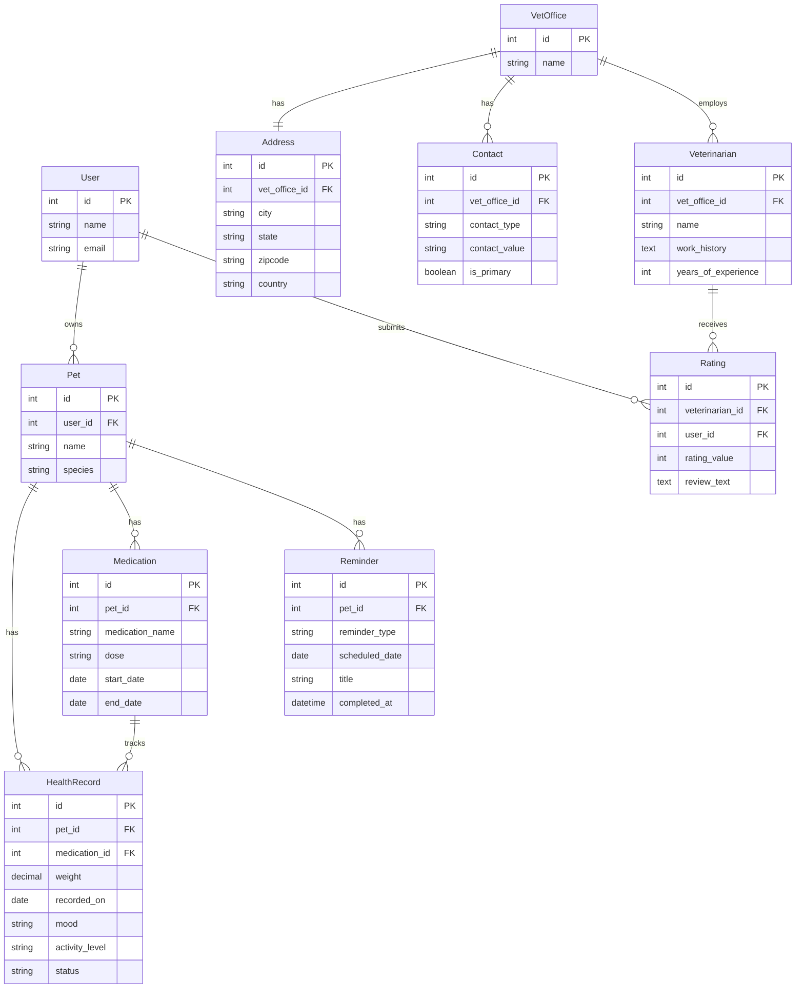

# Design Document: Pet Health Management System

## Overview

The Pet Health Management System extends the existing Rails application with comprehensive health tracking, veterinary management, and reminder functionality. The system integrates with existing User and Pet models to provide a complete pet care solution.

The design follows Rails conventions with ActiveRecord models, RESTful controllers, and a service layer for complex business logic. The system uses Rails' built-in validation, association, and callback mechanisms to ensure data integrity.

## Architecture

### System Components

```
┌─────────────────────────────────────────────────────────────┐
│                     Presentation Layer                       │
│  (Controllers, Views, JavaScript for Visualizations)         │
└─────────────────────────────────────────────────────────────┘
                              │
┌─────────────────────────────────────────────────────────────┐
│                      Service Layer                           │
│  (HealthAlertService, VisualizationService,                  │
│   ReminderService)                                           │
└─────────────────────────────────────────────────────────────┘
                              │
┌─────────────────────────────────────────────────────────────┐
│                       Model Layer                            │
│  (HealthRecord, Medication, VetOffice, Veterinarian,         │
│   Address, Contact, Reminder, Rating)                        │
└─────────────────────────────────────────────────────────────┘
                              │
┌─────────────────────────────────────────────────────────────┐
│                      Database Layer                          │
│  (SQLite/PostgreSQL with ActiveRecord)                       │
└─────────────────────────────────────────────────────────────┘
```

### Design Patterns

- **Service Objects**: Complex business logic (health alerts, visualizations) is encapsulated in service objects
- **ActiveRecord Callbacks**: Automatic health alert generation on health record creation
- **Concerns**: Shared validation and query logic extracted into concerns
- **Decorators**: Presentation logic for health records and visualizations

## Components and Interfaces

### Models

#### HealthRecord

```ruby
class HealthRecord < ApplicationRecord
  belongs_to :pet
  belongs_to :medication, optional: true
  
  validates :recorded_on, presence: true
  validates :weight, numericality: { greater_than: 0 }, allow_nil: true
  validates :status, inclusion: { in: %w[excellent good fair poor critical] }, allow_nil: true
  
  scope :chronological, -> { order(recorded_on: :desc) }
  scope :recent, -> { where('recorded_on >= ?', 30.days.ago) }
  scope :with_weight, -> { where.not(weight: nil) }
  
  after_create :check_health_thresholds
end
```

#### Medication

```ruby
class Medication < ApplicationRecord
  belongs_to :pet
  has_many :health_records
  
  validates :medication_name, presence: true
  validates :dose, presence: true
  validates :start_date, presence: true
  
  scope :active, -> { where('end_date IS NULL OR end_date >= ?', Date.today) }
  scope :inactive, -> { where('end_date < ?', Date.today) }
  
  def active?
    end_date.nil? || end_date >= Date.today
  end
end
```

#### Veterinarian

```ruby
class Veterinarian < ApplicationRecord
  belongs_to :vet_office
  has_many :ratings, dependent: :restrict_with_error
  
  validates :name, presence: true
  validates :years_of_experience, numericality: { greater_than_or_equal_to: 0 }, allow_nil: true
  
  def average_rating
    ratings.average(:rating_value).to_f.round(2)
  end
  
  def total_ratings
    ratings.count
  end
end
```

#### VetOffice

```ruby
class VetOffice < ApplicationRecord
  has_one :address, dependent: :destroy
  has_many :contacts, dependent: :destroy
  has_many :veterinarians, dependent: :nullify
  
  validates :name, presence: true
  
  accepts_nested_attributes_for :address
  accepts_nested_attributes_for :contacts, allow_destroy: true
  
  def primary_phone
    contacts.find_by(contact_type: 'phone', is_primary: true)
  end
  
  def primary_email
    contacts.find_by(contact_type: 'email', is_primary: true)
  end
end
```

#### Address

```ruby
class Address < ApplicationRecord
  belongs_to :vet_office
  
  validates :city, :state, :zipcode, :country, presence: true
  validates :zipcode, format: { with: /\A\d{5}(-\d{4})?\z/, message: "must be valid US format" }, 
                      if: -> { country == 'US' }
  
  def formatted
    "#{city}, #{state} #{zipcode}, #{country}"
  end
  
  def self.near(latitude, longitude, radius_miles = 25)
    # Implementation using geocoding gem or database spatial functions
  end
end
```

#### Contact

```ruby
class Contact < ApplicationRecord
  belongs_to :vet_office
  
  validates :contact_type, inclusion: { in: %w[phone email] }
  validates :contact_value, presence: true
  validates :contact_value, format: { with: URI::MailTo::EMAIL_REGEXP }, if: -> { contact_type == 'email' }
  validates :contact_value, format: { with: /\A\d{10,15}\z/ }, if: -> { contact_type == 'phone' }
  
  before_save :ensure_single_primary_per_type
  
  private
  
  def ensure_single_primary_per_type
    if is_primary? && is_primary_changed?
      Contact.where(vet_office: vet_office, contact_type: contact_type, is_primary: true)
             .where.not(id: id)
             .update_all(is_primary: false)
    end
  end
end
```

#### Rating

```ruby
class Rating < ApplicationRecord
  belongs_to :veterinarian
  belongs_to :user
  
  validates :rating_value, inclusion: { in: 1..5 }
  validates :user_id, uniqueness: { scope: :veterinarian_id, message: "can only rate once per veterinarian" }
  
  after_save :update_veterinarian_average
  after_destroy :update_veterinarian_average
  
  private
  
  def update_veterinarian_average
    veterinarian.touch # Triggers cache invalidation
  end
end
```

#### Reminder

```ruby
class Reminder < ApplicationRecord
  belongs_to :pet
  
  validates :reminder_type, inclusion: { in: %w[vet_appointment medication grooming custom] }
  validates :scheduled_date, presence: true
  validates :title, presence: true
  
  scope :upcoming, -> { where('scheduled_date > ? AND completed_at IS NULL', Date.today) }
  scope :due, -> { where('scheduled_date <= ? AND completed_at IS NULL', Date.today) }
  scope :completed, -> { where.not(completed_at: nil) }
  
  def due?
    scheduled_date <= Date.today && completed_at.nil?
  end
  
  def complete!
    update(completed_at: Time.current)
  end
end
```

### Services

#### HealthAlertService

```ruby
class HealthAlertService
  def initialize(health_record)
    @health_record = health_record
    @pet = health_record.pet
  end
  
  def check_and_alert
    alerts = []
    
    alerts << check_weight_threshold
    alerts << check_activity_level
    alerts << check_declining_trends
    
    alerts.compact.each do |alert|
      create_alert_notification(alert)
    end
  end
  
  private
  
  def check_weight_threshold
    return nil unless @health_record.weight.present?
    
    threshold = weight_threshold_for_species(@pet.species)
    if @health_record.weight < threshold
      {
        type: 'low_weight',
        message: "Weight below recommended threshold for #{@pet.species}",
        severity: 'high'
      }
    end
  end
  
  def check_activity_level
    return nil unless @health_record.activity_level.present?
    
    if @health_record.activity_level == 'very_low'
      {
        type: 'low_activity',
        message: "Activity level is concerning",
        severity: 'medium'
      }
    end
  end
  
  def check_declining_trends
    recent_records = @pet.health_records.recent.with_weight.limit(5)
    return nil if recent_records.count < 3
    
    weights = recent_records.pluck(:weight)
    if consistently_declining?(weights)
      {
        type: 'declining_trend',
        message: "Weight has been declining over recent records",
        severity: 'high'
      }
    end
  end
  
  def consistently_declining?(values)
    values.each_cons(2).all? { |a, b| a > b }
  end
  
  def weight_threshold_for_species(species)
    # Species-specific thresholds
    thresholds = {
      'dog' => 5.0,
      'cat' => 3.0,
      'bird' => 0.1
    }
    thresholds[species.downcase] || 1.0
  end
  
  def create_alert_notification(alert)
    # Create notification record or trigger email/push notification
  end
end
```

#### VisualizationService

```ruby
class VisualizationService
  def initialize(pet, start_date: 6.months.ago, end_date: Date.today)
    @pet = pet
    @start_date = start_date
    @end_date = end_date
  end
  
  def weight_chart_data
    records = @pet.health_records
                  .where(recorded_on: @start_date..@end_date)
                  .with_weight
                  .chronological
    
    {
      labels: records.pluck(:recorded_on),
      datasets: [{
        label: 'Weight (lbs)',
        data: records.pluck(:weight),
        borderColor: 'rgb(75, 192, 192)',
        tension: 0.1
      }]
    }
  end
  
  def medication_timeline_data
    medications = @pet.medications
                      .where('start_date <= ? AND (end_date IS NULL OR end_date >= ?)', 
                             @end_date, @start_date)
    
    medications.map do |med|
      {
        name: med.medication_name,
        dose: med.dose,
        start: med.start_date,
        end: med.end_date || Date.today,
        active: med.active?
      }
    end
  end
  
  def health_metrics_data
    records = @pet.health_records
                  .where(recorded_on: @start_date..@end_date)
                  .chronological
    
    {
      mood: aggregate_by_category(records, :mood),
      activity_level: aggregate_by_category(records, :activity_level),
      food_intake: aggregate_by_category(records, :food_intake)
    }
  end
  
  private
  
  def aggregate_by_category(records, attribute)
    records.where.not(attribute => nil)
           .group(attribute)
           .count
  end
end
```

#### ReminderService

```ruby
class ReminderService
  def self.create_from_health_alert(pet, alert_context)
    Reminder.create(
      pet: pet,
      reminder_type: 'vet_appointment',
      scheduled_date: 7.days.from_now,
      title: 'Vet Appointment Recommended',
      description: "Health alert: #{alert_context[:message]}",
      alert_context: alert_context.to_json
    )
  end
  
  def self.mark_due_reminders
    Reminder.where('scheduled_date <= ? AND completed_at IS NULL', Date.today)
            .update_all(status: 'due')
  end
end
```

### Controllers

#### HealthRecordsController

```ruby
class HealthRecordsController < ApplicationController
  before_action :set_pet
  before_action :set_health_record, only: [:show, :edit, :update, :destroy]
  
  def index
    @health_records = @pet.health_records.chronological.page(params[:page])
    @visualization_data = VisualizationService.new(@pet).weight_chart_data
  end
  
  def create
    @health_record = @pet.health_records.build(health_record_params)
    
    if @health_record.save
      HealthAlertService.new(@health_record).check_and_alert
      redirect_to pet_health_records_path(@pet), notice: 'Health record created.'
    else
      render :new
    end
  end
  
  # ... standard CRUD actions
  
  private
  
  def health_record_params
    params.require(:health_record).permit(
      :weight, :recorded_on, :mood, :activity_level, :food_intake,
      :medication_name, :medication_dose, :status, :notes, :medication_id
    )
  end
end
```

## Data Models

### Database Schema

```ruby
# health_records table
create_table :health_records do |t|
  t.references :pet, null: false, foreign_key: true
  t.references :medication, foreign_key: true
  t.decimal :weight, precision: 5, scale: 2
  t.date :recorded_on, null: false
  t.string :mood
  t.string :activity_level
  t.string :food_intake
  t.string :medication_name
  t.string :medication_dose
  t.string :status
  t.text :notes
  t.timestamps
end

# medications table
create_table :medications do |t|
  t.references :pet, null: false, foreign_key: true
  t.string :medication_name, null: false
  t.string :dose, null: false
  t.date :start_date, null: false
  t.date :end_date
  t.text :notes
  t.timestamps
end

# vet_offices table
create_table :vet_offices do |t|
  t.string :name, null: false
  t.timestamps
end

# addresses table
create_table :addresses do |t|
  t.references :vet_office, null: false, foreign_key: true
  t.string :city, null: false
  t.string :state, null: false
  t.string :zipcode, null: false
  t.string :country, null: false
  t.timestamps
end

# contacts table
create_table :contacts do |t|
  t.references :vet_office, null: false, foreign_key: true
  t.string :contact_type, null: false
  t.string :contact_value, null: false
  t.boolean :is_primary, default: false
  t.timestamps
end

# veterinarians table
create_table :veterinarians do |t|
  t.references :vet_office, null: false, foreign_key: true
  t.string :name, null: false
  t.text :work_history
  t.integer :years_of_experience
  t.timestamps
end

# ratings table
create_table :ratings do |t|
  t.references :veterinarian, null: false, foreign_key: true
  t.references :user, null: false, foreign_key: true
  t.integer :rating_value, null: false
  t.text :review_text
  t.timestamps
  
  t.index [:user_id, :veterinarian_id], unique: true
end

# reminders table
create_table :reminders do |t|
  t.references :pet, null: false, foreign_key: true
  t.string :reminder_type, null: false
  t.date :scheduled_date, null: false
  t.string :title, null: false
  t.text :description
  t.datetime :completed_at
  t.string :status, default: 'pending'
  t.text :alert_context
  t.timestamps
end
```

### Entity Relationship Diagram




## Correctness Properties

A property is a characteristic or behavior that should hold true across all valid executions of a system—essentially, a formal statement about what the system should do. Properties serve as the bridge between human-readable specifications and machine-verifiable correctness guarantees.

### Health Record Properties

**Property 1: Weight precision preservation**
*For any* health record with a weight value, storing and retrieving the weight should preserve precision to 2 decimal places and scale to 5 total digits.
**Validates: Requirements 1.1**

**Property 2: Required date validation**
*For any* health record creation attempt, the record should be rejected if recorded_on is missing, and accepted if recorded_on is present.
**Validates: Requirements 1.2**

**Property 3: Optional fields acceptance**
*For any* health record, creating it with or without mood, activity_level, food_intake, medication_name, medication_dose, status, or notes should succeed.
**Validates: Requirements 1.3**

**Property 4: Chronological ordering**
*For any* set of health records for a pet, querying them should return records ordered by recorded_on date in descending order.
**Validates: Requirements 1.4**

**Property 5: Recorded date immutability**
*For any* health record, updating any field except recorded_on should preserve the original recorded_on value.
**Validates: Requirements 1.5**

**Property 6: Pet association requirement**
*For any* health record creation attempt, the record should be rejected without a pet association and accepted with a valid pet association.
**Validates: Requirements 1.6**

### Health Alert Properties

**Property 7: Low weight alert generation**
*For any* health record with weight below the species-appropriate threshold, creating the record should generate a health alert.
**Validates: Requirements 2.1**

**Property 8: Low activity alert generation**
*For any* health record with activity_level marked as concerning (very_low), creating the record should generate a health alert.
**Validates: Requirements 2.2**

**Property 9: Declining trend detection**
*For any* sequence of 3 or more consecutive health records where each weight is lower than the previous, the system should generate an escalated health alert.
**Validates: Requirements 2.5**

**Property 10: Custom threshold persistence**
*For any* pet with custom health thresholds, setting and then retrieving the thresholds should return the same values.
**Validates: Requirements 2.4**

**Property 11: Alert dismissal prevents repetition**
*For any* dismissed health alert, creating another health record with the same condition should not regenerate an alert for that specific condition.
**Validates: Requirements 10.3**

### Medication Properties

**Property 12: Medication required fields**
*For any* medication creation attempt, the medication should be rejected if medication_name, dose, or start_date is missing, and accepted when all are present.
**Validates: Requirements 3.1**

**Property 13: Active medication filtering**
*For any* set of medications for a pet, querying active medications should return only those where end_date is null or in the future, and inactive medications should return only those where end_date is in the past.
**Validates: Requirements 3.2**

**Property 14: Medication status calculation**
*For any* medication, the active? method should return true when end_date is null or in the future, and false when end_date is in the past.
**Validates: Requirements 3.3**

**Property 15: Medication-pet association**
*For any* medication creation attempt, the medication should be rejected without a pet association and accepted with a valid pet association.
**Validates: Requirements 3.4**

**Property 16: Health record medication linking**
*For any* health record with a medication_id, the health record should be associated with the corresponding medication record.
**Validates: Requirements 3.5**

### Veterinarian Properties

**Property 17: Veterinarian required fields**
*For any* veterinarian creation attempt, the veterinarian should be rejected if name is missing, and accepted when name is present.
**Validates: Requirements 4.1**

**Property 18: Veterinarian associations**
*For any* veterinarian, querying the veterinarian should load the associated vet office and all ratings.
**Validates: Requirements 4.2**

**Property 19: Veterinarian-office association**
*For any* veterinarian creation attempt, the veterinarian should be rejected without a vet office association and accepted with a valid vet office association.
**Validates: Requirements 4.3**

**Property 20: Office change preservation**
*For any* veterinarian, changing the vet_office_id should update the association without deleting historical ratings or other associated data.
**Validates: Requirements 4.4**

**Property 21: Shared veterinarian access**
*For any* veterinarian, multiple users should be able to create ratings for the same veterinarian.
**Validates: Requirements 4.5**

### Rating Properties

**Property 22: Rating required fields**
*For any* rating creation attempt, the rating should be rejected if rating_value is missing, and accepted when rating_value is present.
**Validates: Requirements 5.1**

**Property 23: Average rating calculation**
*For any* veterinarian with multiple ratings, the average_rating method should return the arithmetic mean of all rating_value fields rounded to 2 decimal places.
**Validates: Requirements 5.2**

**Property 24: Rating value constraints**
*For any* rating creation attempt, the rating should be rejected if rating_value is outside the range 1-5, and accepted if within the range.
**Validates: Requirements 5.3**

**Property 25: One rating per user per veterinarian**
*For any* user and veterinarian pair, attempting to create a second rating should be rejected, and updating the existing rating should succeed.
**Validates: Requirements 5.4, 5.5**

### Vet Office Properties

**Property 26: Vet office required fields**
*For any* vet office creation attempt, the office should be rejected if name is missing, and accepted when name is present.
**Validates: Requirements 6.1**

**Property 27: Vet office associations**
*For any* vet office, querying the office should load the associated address and all contacts.
**Validates: Requirements 6.2**

**Property 28: Office-address one-to-one**
*For any* vet office, the office should have exactly one associated address.
**Validates: Requirements 6.3**

**Property 29: Shared vet office access**
*For any* vet office, multiple pets from different users should be able to reference the same vet office.
**Validates: Requirements 6.4**

**Property 30: Location proximity filtering**
*For any* set of vet offices with addresses, filtering by location proximity should return only offices within the specified radius.
**Validates: Requirements 6.5**

### Address Properties

**Property 31: Address required fields**
*For any* address creation attempt, the address should be rejected if city, state, zipcode, or country is missing, and accepted when all are present.
**Validates: Requirements 7.1**

**Property 32: Country-specific zipcode validation**
*For any* address with country set to 'US', the zipcode should be rejected if it doesn't match US format (5 digits or 5+4 digits), and accepted if it matches.
**Validates: Requirements 7.2**

**Property 33: Address formatting**
*For any* address, calling the formatted method should return a string containing city, state, zipcode, and country in a consistent format.
**Validates: Requirements 7.3**

**Property 34: Address-office one-to-one**
*For any* address, the address should be associated with exactly one vet office.
**Validates: Requirements 7.4**

### Contact Properties

**Property 35: Contact required fields**
*For any* contact creation attempt, the contact should be rejected if contact_type or contact_value is missing, and accepted when both are present.
**Validates: Requirements 8.1**

**Property 36: Contact grouping by type**
*For any* vet office with multiple contacts, querying contacts should allow grouping by contact_type.
**Validates: Requirements 8.2**

**Property 37: Contact type validation**
*For any* contact, if contact_type is 'email', contact_value should be rejected if not a valid email format; if contact_type is 'phone', contact_value should be rejected if not a valid phone format.
**Validates: Requirements 8.3**

**Property 38: Multiple contacts per office**
*For any* vet office, creating multiple contacts with different contact_type or contact_value should succeed.
**Validates: Requirements 8.4**

**Property 39: Single primary per type per office**
*For any* vet office and contact_type, marking a contact as primary should automatically unmark any other contact of the same type as primary for that office.
**Validates: Requirements 8.5**

### Reminder Properties

**Property 40: Reminder required fields**
*For any* reminder creation attempt, the reminder should be rejected if reminder_type, scheduled_date, or title is missing, and accepted when all are present.
**Validates: Requirements 9.1**

**Property 41: Due reminder detection**
*For any* reminder, the due? method should return true when scheduled_date is today or in the past and completed_at is nil, and false otherwise.
**Validates: Requirements 9.2**

**Property 42: Reminder completion**
*For any* reminder, calling complete! should set completed_at to the current timestamp.
**Validates: Requirements 9.3**

**Property 43: Reminder type validation**
*For any* reminder creation attempt, the reminder should be rejected if reminder_type is not one of [vet_appointment, medication, grooming, custom], and accepted if it is.
**Validates: Requirements 9.4**

**Property 44: Reminder status grouping**
*For any* set of reminders for a pet, querying should allow filtering into upcoming (future scheduled_date, not completed), due (past/today scheduled_date, not completed), and completed (completed_at present) groups.
**Validates: Requirements 9.5**

**Property 45: Reminder-pet association**
*For any* reminder creation attempt, the reminder should be rejected without a pet association and accepted with a valid pet association.
**Validates: Requirements 9.6**

### Alert-Reminder Integration Properties

**Property 46: Alert context transfer**
*For any* health alert that creates a reminder, the reminder should contain the alert context in its description or alert_context field.
**Validates: Requirements 10.2**

**Property 47: Alert sensitivity configuration**
*For any* user or pet, setting an alert sensitivity level and then retrieving it should return the same value.
**Validates: Requirements 10.4**

### Data Integrity Properties

**Property 48: Pet deletion cascade**
*For any* pet with associated health records, medications, and reminders, deleting the pet should also delete all associated records.
**Validates: Requirements 11.1**

**Property 49: User deletion cascade**
*For any* user with associated pets, deleting the user should also delete all pets and their associated health data.
**Validates: Requirements 11.2**

**Property 50: Vet office deletion cascade**
*For any* vet office with an associated address and contacts, deleting the office should also delete the address and contacts.
**Validates: Requirements 11.3**

**Property 51: Veterinarian deletion restriction**
*For any* veterinarian with associated ratings, attempting to delete the veterinarian should fail with an error.
**Validates: Requirements 11.4**

**Property 52: Foreign key enforcement**
*For any* model with foreign key relationships, attempting to create a record with an invalid foreign key should be rejected.
**Validates: Requirements 11.5**

**Property 53: Validation before persistence**
*For any* model, attempting to save a record with invalid data should be rejected before database persistence.
**Validates: Requirements 11.6**

### Visualization Properties

**Property 54: Weight chart data structure**
*For any* pet with health records in a date range, the weight chart data should include arrays of dates and corresponding weights for all records with weight values.
**Validates: Requirements 12.1**

**Property 55: Medication timeline data structure**
*For any* pet with medications, the timeline data should include medication name, dose, start date, end date, and active status for each medication.
**Validates: Requirements 12.2**

**Property 56: Visualization date filtering**
*For any* pet and date range, visualization data should include only health records and medications within the specified date range.
**Validates: Requirements 12.3**

**Property 57: Multi-metric visualization**
*For any* pet with health records, the visualization data should include aggregated data for mood, activity_level, and food_intake.
**Validates: Requirements 12.5**

### Historical Data Properties

**Property 58: Date range filtering**
*For any* pet and date range, querying health history should return only records where recorded_on falls within the specified range.
**Validates: Requirements 13.1**

**Property 59: Weight change calculation**
*For any* sequence of health records with weights, calculating weight changes should return the difference between consecutive weight values.
**Validates: Requirements 13.2**

**Property 60: Medication duration calculation**
*For any* medication, the duration should be calculated as the difference between end_date and start_date (or current date if end_date is null).
**Validates: Requirements 13.3**

**Property 61: Historical data immutability**
*For any* health record, viewing or querying the record should not modify any of its field values.
**Validates: Requirements 13.5**

## Error Handling

### Validation Errors

All models implement ActiveRecord validations that return user-friendly error messages:

```ruby
# Example validation error handling
def create
  @health_record = @pet.health_records.build(health_record_params)
  
  if @health_record.save
    redirect_to pet_health_records_path(@pet), notice: 'Health record created.'
  else
    flash.now[:alert] = @health_record.errors.full_messages.join(', ')
    render :new, status: :unprocessable_entity
  end
end
```

### Common Error Scenarios

1. **Missing Required Fields**: Return 422 Unprocessable Entity with validation errors
2. **Invalid Foreign Keys**: Return 422 with "Pet must exist" or similar message
3. **Uniqueness Violations**: Return 422 with "has already been taken" message
4. **Format Validation Failures**: Return 422 with specific format error messages
5. **Deletion Restrictions**: Return 422 with "Cannot delete record because dependent X exist"

### Service Layer Error Handling

```ruby
class HealthAlertService
  def check_and_alert
    alerts = []
    
    begin
      alerts << check_weight_threshold
      alerts << check_activity_level
      alerts << check_declining_trends
    rescue StandardError => e
      Rails.logger.error("Health alert check failed: #{e.message}")
      # Continue execution, don't fail the health record creation
    end
    
    alerts.compact.each do |alert|
      create_alert_notification(alert)
    rescue StandardError => e
      Rails.logger.error("Alert notification failed: #{e.message}")
      # Log but don't fail
    end
  end
end
```

### Database Constraint Errors

- Foreign key violations are caught and converted to user-friendly messages
- Unique constraint violations are handled by ActiveRecord validations
- NOT NULL constraints are enforced by model validations before database interaction

## Testing Strategy

### Dual Testing Approach

The system requires both unit tests and property-based tests for comprehensive coverage:

- **Unit tests**: Verify specific examples, edge cases, and error conditions
- **Property tests**: Verify universal properties across all inputs using randomized data

### Property-Based Testing Configuration

We will use the `rantly` gem for property-based testing in Ruby/Rails:

```ruby
# Gemfile
group :test do
  gem 'rantly'
end
```

Each property test must:
- Run minimum 100 iterations
- Reference its design document property number
- Use the tag format: **Feature: pet-health-management, Property {number}: {property_text}**

### Example Property Test

```ruby
# test/models/health_record_test.rb
require 'test_helper'
require 'rantly/rspec_extensions'

class HealthRecordTest < ActiveSupport::TestCase
  # Feature: pet-health-management, Property 1: Weight precision preservation
  test "weight values preserve precision to 2 decimal places" do
    pet = pets(:one)
    
    property_of {
      Rantly { range(0.01, 999.99).round(2) }
    }.check(100) { |weight|
      record = HealthRecord.create!(
        pet: pet,
        recorded_on: Date.today,
        weight: weight
      )
      
      assert_equal weight.round(2), record.reload.weight.to_f
    }
  end
  
  # Feature: pet-health-management, Property 4: Chronological ordering
  test "health records are returned in chronological order" do
    pet = pets(:one)
    
    property_of {
      dates = Array.new(5) { Rantly { date } }
      dates
    }.check(100) { |dates|
      # Create records with random dates
      records = dates.map do |date|
        HealthRecord.create!(pet: pet, recorded_on: date)
      end
      
      # Query records
      queried = pet.health_records.chronological
      
      # Verify they're in descending order
      queried.each_cons(2) do |a, b|
        assert a.recorded_on >= b.recorded_on
      end
    }
  end
end
```

### Unit Testing Focus

Unit tests should focus on:
- Specific examples that demonstrate correct behavior
- Edge cases (empty strings, boundary values, nil values)
- Error conditions and validation failures
- Integration between components
- Callback behavior (after_create, before_save)

### Test Coverage Requirements

- All models: 100% coverage of validations, associations, and methods
- All services: 100% coverage of public methods
- All controllers: Coverage of CRUD actions and error paths
- Property tests: All 61 correctness properties implemented
- Unit tests: All edge cases and error conditions covered

### Testing Tools

- **Minitest**: Rails default testing framework
- **Rantly**: Property-based testing gem
- **FactoryBot**: Test data generation
- **SimpleCov**: Code coverage reporting
- **Database Cleaner**: Test database management
